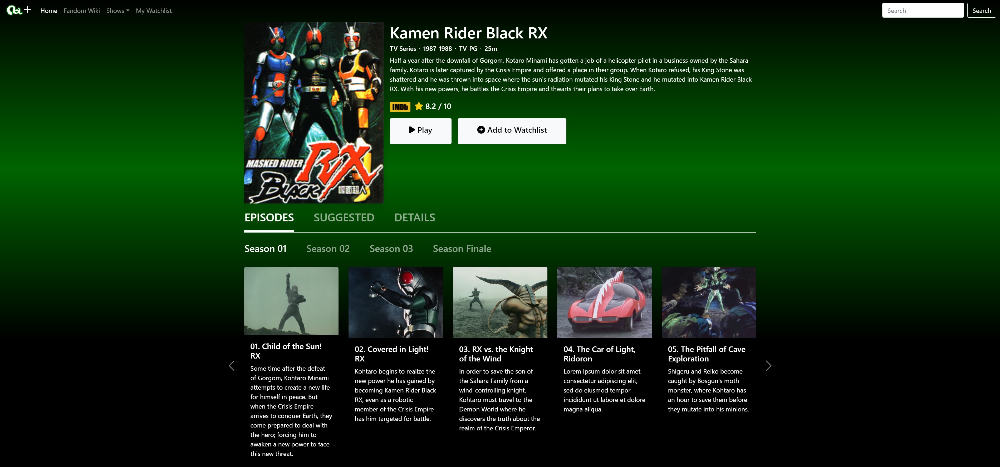

# Batang 90s TV+

Streaming platform of my childhood favourite TV shows in the 90s:
1. Masked Rider Black RX
2. Uchuu Keiji Shaider
3. Kousoku Sentai Turboranger
4. Hikari Sentai Maskman
5. Masked Rider Black

## Future architecture to consider:
### Can I use Wasabi to host my videos?
Public cloud object storage services like AWS S3 and Wasabi can be used to store videos.  However, we do not recommend the playback of video directly from object storage (Wasabi or AWS S3) as the costs may be higher than expected and the delivery quality will be sub-optimal (as compared to solutions that pair object storage with a CDN and/or encoding/decoding functions).  Further details on these points are provided below.

1.  The business model with public cloud object storage is that egress traffic (i.e. downloads) from the storage service to the player location is generally chargeable on a per-GB basis*.  The price is generally less than $.10 per GB but if you are doing many downloads and the files are large, this can result in some meaningful egress fee charges.   Wasabi does not charge for egress but our pricing model is not suitable for use cases involving the hosting of videos in a manner where the ratio of egress downloads exceeds the amount of storage.   Please see the relevant policy details in our Pricing FAQs for more info.

2.  Depending on the location of your video player and other network conditions, it may be necessary to utilize a content delivery network (CDN) service along with the storage service for the best quality video viewing experience.

Another benefit of using a CDN is that you can reduce the amount of downloads from Wasabi. This is because if you have a video (for example) that is going to be played 100+ times, the CDN will generally download the file once (or just a few times) from Wasabi and then cache it for playback to many different users.  The CDN caching is generally done in a location that is closer to the viewer, which results in a better viewing experience.

3. Public cloud storage services do not provide any encoding / decoding functions.    This means (for example), if you store the video file in a format like .mp4 and you need the video player to receive the video in a different format, this function must be performed outside of the storage service.

Ref: https://wasabi-support.zendesk.com/hc/en-us/articles/360000451052-Can-I-use-Wasabi-to-host-my-videos-